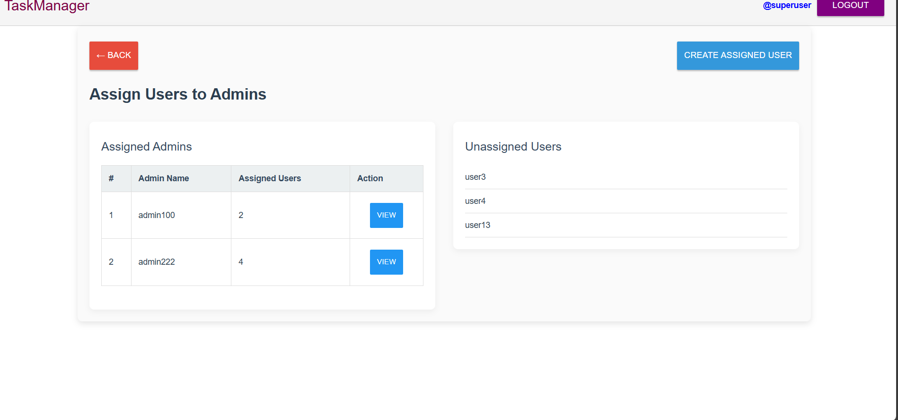

# Django Project with DRF & Template Rendering

This project integrates Django REST Framework (DRF) and traditional template rendering. You can access the login page via a browser, or interact with the API using Postman.

## postman documention : https://documenter.getpostman.com/view/44984967/2sB3HqJK7j#d45695bd-eec4-467c-a9c0-5b786dc849c3

## Dockerhub link: 

## Github link: https://github.com/c-abhijith/Task-Management-System.git

## SETUP INSTRUCTIONS:
    Clone gitrepo:
                git clone https://github.com/c-abhijith/Task-Management-System.git
                
                cd Task-Management-System

    For Linux or macOS users:
                Run the following commands in your terminal:
                                make env-setup
                                make run-local

    For Windows users:

        Run the following commands in Command Prompt or PowerShell:

                                python3 -m venv venv
                                .\venv\Scripts\activate
                                pip install -r requirements.txt

                                python manage.py makemigrations
                                                or 
                                python manage.py makemigrations taskmanager

                                python manage.py migrate
                                                or 
                                python manage.py migrate taskmanager

                                python manage.py runserver

## Templated URL
        LoginUrl: http://127.0.0.1:8000/login/

## RestURL

        please follow postman url

        https://documenter.getpostman.com/view/44984967/2sB3HqJK7j#d45695bd-eec4-467c-a9c0-5b786dc849c3

## You can create a superuser using the following command:         

            python manage.py createsuperuser
    
        Alternatively, a superuser has already been created with the following credentials:

                username : Superuser
                password : Password

## Admin and User password

                password : password

        

## TestCase

## Docker commands 
        -  docker-compose up --build

## Images
### Super user home page 

### Assing user into the addmin

